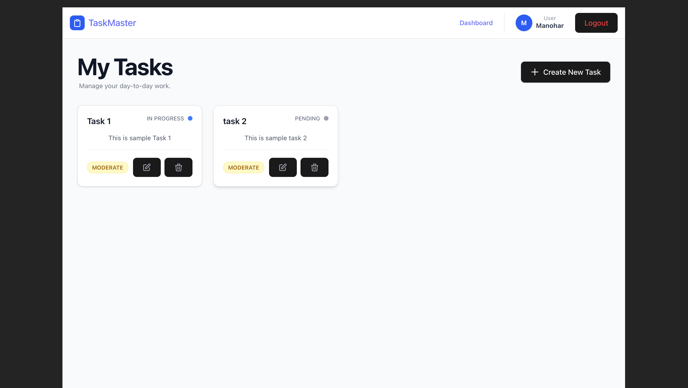
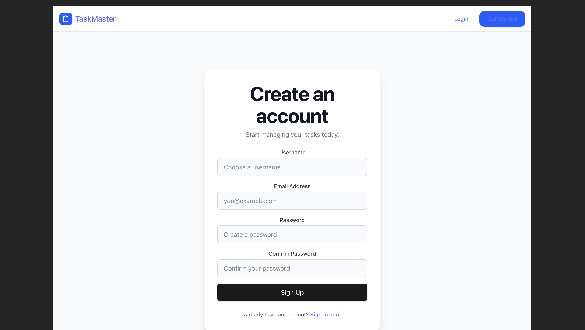
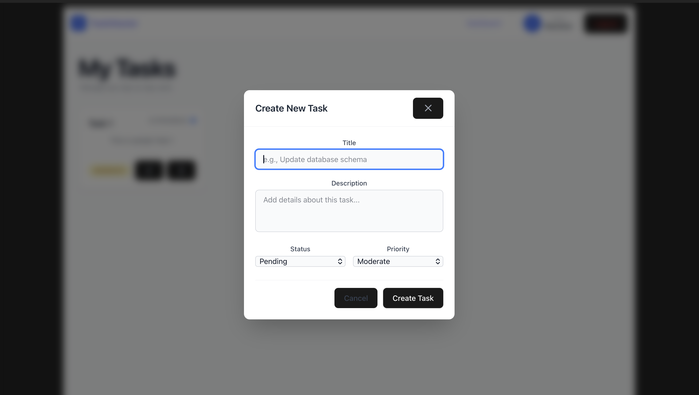

# TaskMaster - Full Stack Task Management System

A modern, full-stack task management application designed for productivity. This project features a robust **Django REST Framework (DRF)** backend and a responsive **React** frontend styled with **Tailwind CSS**.

## 📸 Project Preview

### Dashboard


### Authentication
<p align="center">
  
  
</p>


## 🚀 Features

* **Secure Authentication**: JWT-based login and registration system.
* **Task CRUD**: Create, read, update, and delete tasks with real-time UI updates.
* **Data Scoping**: Users can only see and manage their own tasks, enforced via Django querysets.
* **Modern UI**: Responsive dashboard with priority color-coding and status tracking.
* **Profile Management**: Dedicated profile view displaying user account details.

## 🛠️ Tech Stack

### Frontend
* **React (Vite)**: Component-based architecture.
* **Tailwind CSS**: Modern utility-first styling.
* **Axios**: For API communication with custom interceptors.
* **React Router**: Client-side routing with Protected Route logic.

### Backend
* **Django & DRF**: RESTful API architecture.
* **SimpleJWT**: Token-based authentication.
* **PostgreSQL**: Relational database for persistent storage.
* **Custom User Model**: Specialized user handling with email-based authentication.

## 📂 Project Structure

```text
├── backend/
│   ├── apps/
│   │   ├── todo/       # Task models, views, and serializers
│   │   └── users/      # Custom User models and auth logic
│   └── config/         # Project settings and URL routing
└── frontend/
    ├── src/
    │   ├── components/ # Reusable UI (TaskCard, Navbar, etc.)
    │   ├── pages/      # Home, Login, Register, Profile
    │   ├── services/   # Axios API configurations
    │   └── types/      # TypeScript interfaces

```

## ⚙️ Installation & Setup

### 1. Backend Setup

1. Navigate to the backend folder: `cd backend`
2. Create and activate a virtual environment: `python -m venv .venv`
3. Install dependencies: `pip install -r requirements.txt`
4. Run migrations: `python manage.py migrate`
5. Start the server: `python manage.py runserver`

### 2. Frontend Setup

1. Navigate to the frontend folder: `cd frontend`
2. Install dependencies: `npm install`
3. Configure Tailwind: Ensure `tailwind.config.js` is set up.
4. Start the development server: `npm run dev`

## 📡 API Endpoints

| Method | Endpoint | Description |
| --- | --- | --- |
| POST | `/api/v1/token/` | Obtain JWT Access/Refresh tokens |
| POST | `/api/v1/users/register/` | Register a new account |
| GET | `/api/v1/users/me/` | Fetch current user profile |
| GET/POST | `/api/v1/tasks/` | List and Create tasks |
| PUT/PATCH/DEL | `/api/v1/tasks/<uuid:pk>/` | Manage specific tasks |

